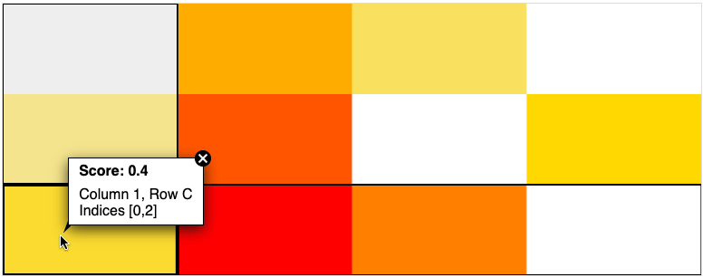

<!-- README for GitHub -->

# HeatmapComponent

TypeScript library for creating interactive grid heatmaps.

The goal of HeatmapComponent is to provide a tool for visualizing two-dimensional data in the form of grid heatmaps. It focuses on interactivity, performance, and customizability.

### Features

-   Data type flexibility: appropriate for 2D arrays of numerical data, categorical data, and more complex data types
-   Customizable color scheme
-   Interactivity:
    -   Zooming (currently only in x-axis direction)
    -   Markers: highlighting current column, row, and data item
    -   Tooltips: showing custom content when the user hovers or clicks a data item
-   Efficient canvas-based rendering: smooth visualizations even with millions of data items
-   Integrability with other components via exposed events (hover, select, zoom...)
-   Extensibility: new behaviors can be added via extensions

### What it doesn't do

-   Visualization of data that don't fit into a 2D grid
-   Other shapes than rectangles
-   Axis labeling
-   Data loading or modification via UI

### Example of HeatmapComponent visualization



### Live demos

<https://pdbeurope.github.io/heatmap-component/> (deployed from `main` branch)

## Documentation

-   Documentation for the current repository: [./docs/README.md](./docs/README.md)
-   Documentation for the latest release: <https://github.com/PDBeurope/heatmap-component/blob/v0.10.0/docs/README.md>

## npm package

This package is published to npm:

<https://www.npmjs.com/package/heatmap-component>

## Development

### Get source code

```sh
git clone https://github.com/PDBeurope/heatmap-component.git
cd heatmap-component/
```

### Install dependencies and build

```sh
npm install
npm run rebuild
```

### Run locally

```sh
npm run start
```

Then go to http://localhost:7000/

### Release

To release a new version of this package:

-   Change version in `package.json`
-   Change version in the documentation link in `README.md` and `README.npm.md`
-   Update `CHANGELOG.md`
-   Run `npm install` (to update `package-lock.json`)
-   Ensure `npm run lint && npm run rebuild && npm run test` works properly
-   Commit and push to `main` branch (use the version with prepended "v" as the commit message, e.g. `v1.0.0`)
-   Create a git tag matching the version with prepended "v" (e.g. `v1.0.0`)
-   GitHub workflow will automatically publish npm package (https://www.npmjs.com/package/heatmap-component)
-   The files will become available via jsDelivr (`@latest` can be replaced by a specific version (e.g. `@1.0.0`)):
    -   https://cdn.jsdelivr.net/npm/heatmap-component@latest/build/heatmap-component.js
    -   https://cdn.jsdelivr.net/npm/heatmap-component@latest/build/heatmap-component.css
-   Go to https://www.jsdelivr.com/tools/purge and purge the cache for abovementioned URLs (otherwise it might take up to 7 days to before `@latest` starts pointing to the new version)
